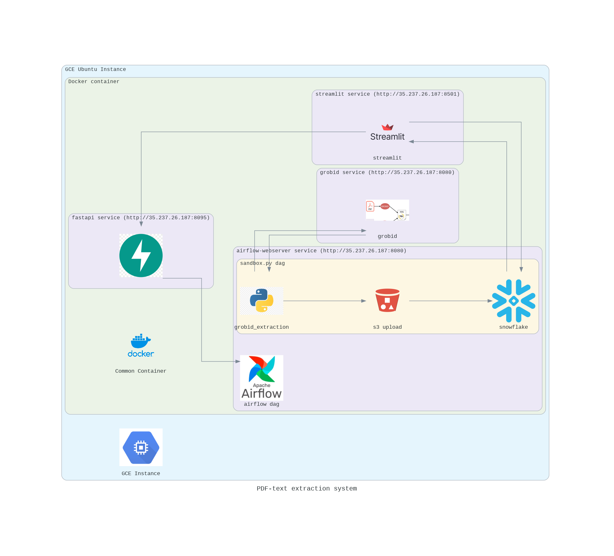

## Big Data Systems and Intelligence Analytics (DAMG 7245)

| Name         | Email                        | NUID    |
| ------------ | ---------------------------- | ------- |
| Ameya Apte   | apte.ame@northeastern.edu    | 2764540 |
| Sayali Dalvi | dalvi.sa@northeastern.edu    | 2799803 |
| Soeb Hussain | hussain.soe@northeastern.edu | 2747200 |

# Assignment 4 

## Problem Statement

The assignment involves building a comprehensive data processing system that automates the extraction, validation, and loading of data from PDF files into a Snowflake database. 

This system integrates various technologies and platforms, including 
1. Airflow for workflow automation, 
2. Fast API for creating API services, 
3. Streamlit for the end-user interface, and 
4. Docker for containerization. 

The workflow begins with a Streamlit application where users upload PDF files to an S3 bucket. These uploads trigger an Airflow pipeline that processes the data and loads it into Snowflake. 

The entire system is designed to operate online, with all components containerized using Docker and hosted on a cloud platform. 

 
## Objective :

* Streamlit Application Development:
    * Design and develop a user-friendly interface for file upload.
    * Authentication page for safe access to data
    * Implement file storage functionality to upload files to S3.
    * Integrate functionality to trigger the Airflow pipeline upon file upload.

* Airflow Pipeline Development:

    * Set up an Airflow environment.
    * Create DAGs for the data extraction, validation, and loading processes.
    * Ensure the pipeline is triggered by the Streamlit app via the Fast API service.

* Fast API Service Development:

    * Develop an API endpoint to accept S3 file locations.
    * Implement functionality to trigger the Airflow pipeline.
    * Ensure proper authentication and error handling.
    * Develop an API endpoint for executing queries on Snowflake.
    * Implement functionality to return query results to the Streamlit app.

* Snowflake Setup and Integration:

    * Configure Snowflake for data storage.
    * Ensure the Airflow pipeline can load data into Snowflake efficiently.
    * Set up necessary schemas and tables in Snowflake.

* Dockerization and Deployment:

    * Containerize the Streamlit app and all Fast API services using Docker.
    * Deploy all services to a cloud platform ensuring they are accessible online.

## Live application links 
* [Codelabs](https://docs.getdbt.com/docs/introduction)
* [Streamlit](https://docs.getdbt.com/docs/introduction)

## Technology Used

## Technologies Used


[](https://www.python.org/)
[](https://github.com/)
[](https://streamlit.io/)
[
](https://www.snowflake.com/en/?_ga=2.41504805.669293969.1706151075-1146686108.1701841103&_gac=1.160808527.1706151104.Cj0KCQiAh8OtBhCQARIsAIkWb68j5NxT6lqmHVbaGdzQYNSz7U0cfRCs-STjxZtgPcZEV-2Vs2-j8HMaAqPsEALw_wcB)

[](https://airflow.apache.org/)
[](https://fastapi.tiangolo.com/)
[](https://www.docker.com)
[](https://cloud.google.com)

## Project Structure 
```
📦 
├─ .gitignore
├─ LICENSE
├─ README.md
├─ airflow
│  ├─ Dockerfile
│  ├─ dags
│  │  ├─ sandbox.py
│  │  ├─ sandbox1.txt
│  │  └─ test.py
│  ├─ grobid_client_python
│  ├─ logs
│  │  └─ scheduler
│  │     └─ latest
│  ├─ output_data
│  │  ├─ cleaned_csv
│  │  │  └─ 224_links.txt
│  ├─ requirements.txt
│  ├─ requirements_old.txt
│  ├─ scripts
│  │  ├─ driver.py
│  │  ├─ output_data
│  │  │  └─ cleaned_csv
│  │  │      └─ 224_links.txt
│  │  ├─ parse_grobid_xml.py
│  │  ├─ requirements.txt
│  │  ├─ snowflake_setup.py
│  │  ├─ utility.py
│  │  └─ web_scaping_url_dataset_creation.py
│  └─ scripts1
│     └─ welcome.py
├─ airflow_test
│  ├─ Dockerfile
│  ├─ airflow
│  │  ├─ Dockerfile
│  │  ├─ dags
│  │  │  ├─ sandbox.py
│  │  │  ├─ sandbox1.txt
│  │  │  └─ test.py
│  │  ├─ grobid_client_python
│  │  ├─ logs
│  │  │  └─ scheduler
│  │  │     └─ latest
│  │  ├─ output_data
│  │  │  ├─ cleaned_csv
│  │  │  │  └─ 224_links.txt
│  │  ├─ requirements.txt
│  │  ├─ scripts
│  │  │  ├─ 3.8
│  │  │  ├─ driver.py
│  │  │  ├─ parse_grobid_xml.py
│  │  │  ├─ requirements.txt
│  │  │  ├─ snowflake_setup.py
│  │  │  ├─ utility.py
│  │  │  └─ web_scaping_url_dataset_creation.py
│  │  └─ scripts1
│  │     └─ welcome.py
│  ├─ docker-compose.yaml
│  ├─ requirements.txt
│  ├─ ssh
│  └─ ssh.pub
├─ docker
├─ docker-compose.yaml
├─ fastapi
│  ├─ .gitignore
│  ├─ Dockerfile
│  ├─ database.py
│  ├─ main.py
│  ├─ model.py
│  ├─ requirements.txt
│  ├─ routers
│  │  ├─ __init__.py
│  │  ├─ airflow_service.py
│  │  ├─ aws_service.py
│  │  └─ snowflake_service.py
│  └─ utils
│     ├─ __init__.py
│     └─ util.py
└─ streamlit
   ├─ Dockerfile
   ├─ UIenv
   │  ├─ bin
   │  │  ├─ Activate.ps1
   │  │  ├─ activate
   │  │  ├─ activate.csh
   │  │  ├─ activate.fish
   │  │  ├─ dotenv
   │  │  ├─ f2py
   │  │  ├─ jp.py
   │  │  ├─ jsonschema
   │  │  ├─ markdown-it
   │  │  ├─ normalizer
   │  │  ├─ pip
   │  │  ├─ pip3
   │  │  ├─ pip3.10
   │  │  ├─ pygmentize
   │  │  ├─ python
   │  │  ├─ python3
   │  │  ├─ python3.10
   │  │  ├─ streamlit
   │  │  └─ streamlit.cmd
   │  ├─ etc
   │  │  └─ jupyter
   │  │     └─ nbconfig
   │  │        └─ notebook.d
   │  │           └─ pydeck.json
   │  ├─ pyvenv.cfg
   │  └─ share
   │     └─ jupyter
   │        └─ nbextensions
   │           └─ pydeck
   │              ├─ extensionRequires.js
   │              ├─ index.js
   │              └─ index.js.map
   ├─ config.yaml
   ├─ main.py
   ├─ menu.py
   ├─ pages
   │  ├─ .env.txt
   │  ├─ page_1.py
   │  ├─ page_2.py
   │  └─ page_3.py
   ├─ requirements.txt
   └─ service.py
```
©generated by [Project Tree Generator](https://woochanleee.github.io/project-tree-generator)

## Architecture Diagram



## Prerequisites
Before setting up the project, please make sure you have the following prerequisites installed and configured:

- **Python**: The project is built with Python. Ensure you have Python installed on your system. You can download it from [python.org](https://www.python.org/).

- **Docker**: This project uses Docker containers for ensuring consistency across various development environments. Install Docker Desktop from [Docker's official site](https://www.docker.com/products/docker-desktop).

- **Virtual Environment**: Use a virtual environment to manage the project's dependencies separately from other Python projects on your system. You can create a virtual environment using tools like `virtualenv` or the built-in `venv` module:
    ``` 
    python -m venv venv
    source venv/bin/activate  # On Windows use venv\Scripts\activate 
    ```
  

## How to use
* Clone the project repository:
        ```git clone <repository-url>```

* configure the .env configration file 
    ```
    # Environment Variables

    Below is the list of environment variables needed for the project. Please replace `<placeholder>` with your actual values.
    plaintext
    SNOWFLAKE_USER='<placeholder>'
    SNOWFLAKE_PASSWORD='<placeholder>'
    SNOWFLAKE_DATABASE='DAMG_7245_CFA_DB'
    SNOWFLAKE_WAREHOUSE='DAMG_7245_WH_XS'
    SNOWFLAKE_ACCOUNT_IDENTIFIER='<placeholder>'
    SNOWFLAKE_ACCOUNT='<placeholder>'

    SNOWFLAKE_DBT_WAREHOUSE = "data_scraping"
    SNOWFLAKE_DBT_SCHEMA = "web_data"
    SNOWFLAKE_SCHEMA = "web_data"

    SNOWFLAKE_DBT_PROD_DB = "scraping_prod"
    SNOWFLAKE_DBT_DEV_DB = "scraping_dev"

    SNOWFLAKE_DBT_TOPIC_TABLE = 'topics'
    SNOWFLAKE_DBT_CONTENT_TABLE = 'contents'
    SNOWFLAKE_DBT_META_TABLE = 'metadata'
    SNOWFLAKE_DBT_URLDATA_TABLE = 'urldata'

    DIR_CFA_WEB = './output_data/cleaned_csv/'
    CSV_CFA_WEB = 'FinanceHub.csv'
    TXT_CFA_LINKS = '224_links.txt'

    PDF_DIR_PATH='data/'
    OUTPUT_DIR_PATH='./output_data'
    LOCAL_PATH = './output_data/cleaned_csv/'

    S3_BUCKET_NAME = 'cfa-pdfs'
    S3_FOLDER_NAME = 'clean_csv_data'
    S3_ACCESS_KEY = '<placeholder>'
    S3_SECRET_KEY = '<placeholder>'
    S3_REGION='us-east-2'
    S3_UPLOAD_PDF_FOLDER = "uploads"

    API_URL = "http://localhost:80"
    S3_UPLOAD_ENDPOINT = './upload_s3_2/'

    AIRFLOW_API_URL = "http://localhost:8080"
    AIRFLOW_USERNAME = 'airflow'
    AIRFLOW_PASSWORD = 'airflow'

    
    ```
* Build the containers ```docker-compose build```
* Start the containers ```docker-compose up```

## How to contribute

### Installation 

* Clone the project repository:
        ```git clone <repository-url>```

* Navigate to the a project directory:
        ```cd <component folder>```

* Activate the virtual environment:
```source venv/bin/activate ```

* Install the required dependencies:
```pip install -r requirements.txt```


